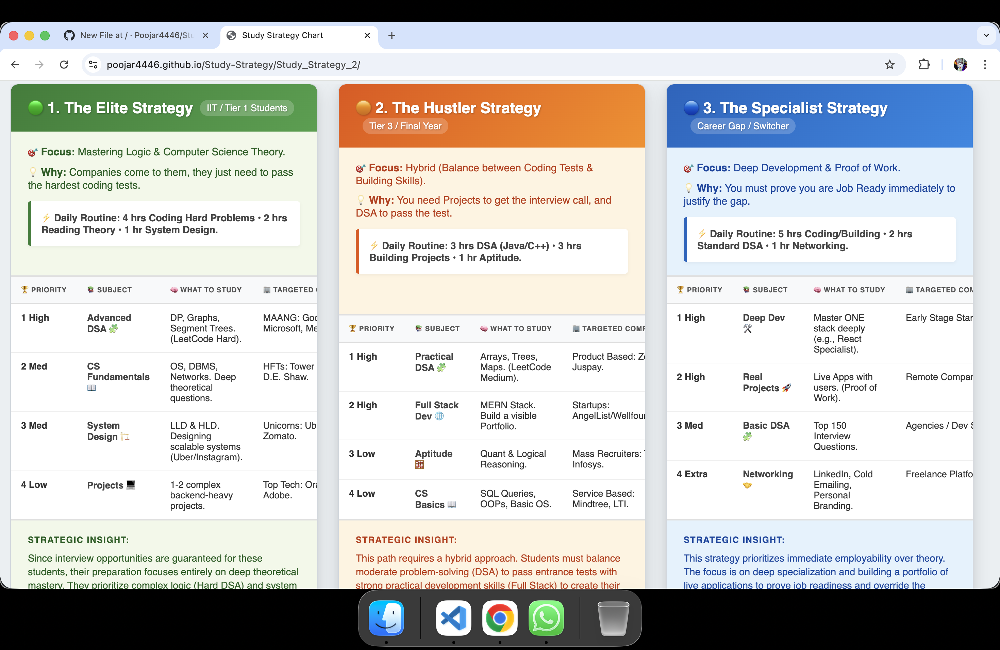

📘 Study Strategy Project
A simple and clean frontend project that presents different study strategies using separate web pages.
This project is built to practice HTML, CSS, folder structuring, and GitHub Pages deployment.

🔗 Live Demo
👉 Live Website:
https://poojar4446.github.io/Study-Strategy/

🛠️ Technologies Used
HTML5
CSS3
Git & GitHub
GitHub Pages

🎯 Purpose of the Project
This project was created to:
Practice frontend fundamentals (HTML & CSS)
Understand project folder structuring
Learn GitHub workflow (commit, push, deploy)
Deploy a live website using GitHub Pages
Build resume-ready beginner projects.

🚀 Deployment
The project is deployed using GitHub Pages.
Deployment steps followed:
1. Created a root index.html
2. Enabled GitHub Pages from repository settings
3. Deployed from main branch
4. Verified live URL

👩‍💻 Author
Pooja R
Electrical & Electronics Engineering Graduate (2024)
Learning Frontend & Full-Stack Development.

✅ How to add this to GitHub
1. Go to your Study-Strategy repository
2. Click Add file → Create new file
3. Name it: README.md
4. Paste the content above
5. Click Commit new file

Screenshots

